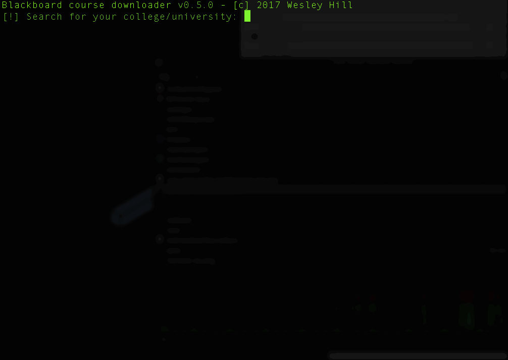

# blackboard-dl

A small tool to download lectures and workshops automagically because i'm too lazy to sign in to BlackBoard.



## Requirements
+ [Crystal](https://crystal-lang.org) 
    +   [Installation Mac/Linux](https://crystal-lang.org) (Sorry Windows users!)
+ Your university must have BlackBoard.

## Install

```
  git clone https://github.com/hako/blackboard-dl
  shards install
  crystal build src/blackboard-dl.cr
  ./blackboard-dl
```

## Usage
```
usage: blackboard-dl [-h] [-d] [-u USERNAME] [-p PASSWORD] [--version]

download course files from blackboard.

optional arguments:
    -u USERNAME, --username          Blackboard username
    -p PASSWORD, --password          Blackboard password
    -d, --daemon                     Run as daemon
    -h, --help                       Show this help
    -v, --version                    Show program version
```

### Examples

##### Auto-login
```
./blackboard-dl -u USERNAME -p PASSWORD
```

##### Auto-login and daemonize
```
./blackboard-dl -d -u USERNAME -p PASSWORD
```

And now watch it download your lectures & workshops. 

## Contributing

1. Fork it ( https://github.com/hako/blackboard-dl/fork )
2. Create your feature branch (git checkout -b my-new-feature)
3. Commit your changes (git commit -am 'Add some feature')
4. Push to the branch (git push origin my-new-feature)
5. Create a new Pull Request

## Contributors

- [hako](https://github.com/hako) Wesley Hill - creator, maintainer

### License

MIT
